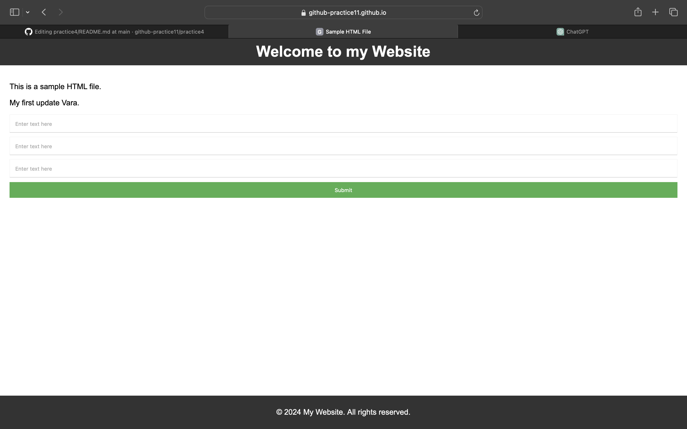

# instructions
This HTML file includes a basic structure with a header, main content area, and footer. It also includes some simple styling using CSS. You can further customize and expand upon this template according to your needs.

access the page 

https://github-practice11.github.io/practice4/

